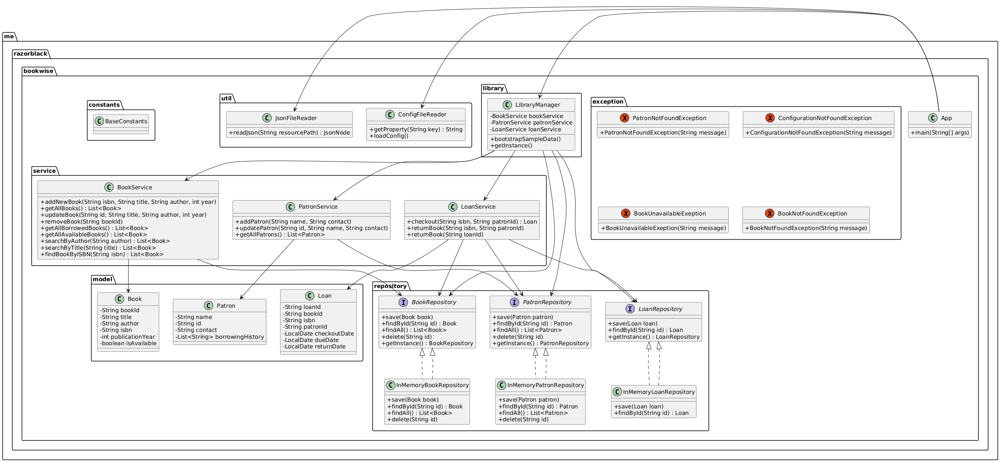

<div align="center">

# 📚 BookWise
<strong>A lightweight, extensible Library Management System (LMS) built with Java 11, Maven, and a clean layered architecture.</strong>



</div>

## ✨ Overview
BookWise is a console-based library management system that demonstrates clean separation of concerns using:

- Domain models (`Book`, `Patron`, `Loan`)
- Repository layer (currently in-memory, easily replaceable)
- Service layer encapsulating business logic
- A singleton `LibraryManager` for wiring dependencies
- Configuration & utility helpers (`ConfigFileReader`, `JsonFileReader`)

It is ideal for learning layered architecture, prototyping, or as a foundation to evolve into a REST API / full-stack application.

## ✅ Current Features
- Book catalog management (add, update, remove, list)
- Patron management (add, update, list)
- Book search (by title, author, ISBN; case-insensitive & partial match)
- Borrow / return workflow (by loan id or patron+book)
- Track availability & borrowed books
- Configuration-driven behavior (e.g. default loan period, storage strategy placeholder)
- Logging via SLF4J + Log4j2
 - Data seeding hook (JSON bootstrap via `LibraryManager.bootstrapSampleData()` and files in `src/main/resources/data`)

## 🧱 Architecture Layers
| Layer | Responsibility | Key Types |
|-------|----------------|-----------|
| Model | Domain entities | `Book`, `Patron`, `Loan` |
| Repository | Data persistence abstraction | `BookRepository`, `PatronRepository`, `LoanRepository` (+ in-memory impls) |
| Service | Business rules & operations | `BookService`, `PatronService`, `LoanService` |
| Orchestration | Dependency wiring & lifecycle | `LibraryManager` (singleton) |
| UI (CLI) | User interaction loop | `App` |
| Utilities | Cross-cutting helpers | `ConfigFileReader`, `JsonFileReader` |
| Config | Externalized settings | `config.properties`, `log4j2.xml` |

### Dependency Flow
`App (CLI)` → `LibraryManager` → Services → Repositories → In-Memory Collections

Services never know about the CLI; repositories are swappable (e.g. DB, file, REST) by altering the factory method and configuration.

## 🔍 Class Diagram (PlantUML)
The following PlantUML definition (also stored in `assets/ClassDiagramPlantUml.txt`) models the system:

```plantuml
@startuml
skinparam classAttributeIconSize 0
package "me.razorblack.bookwise" { class App }
package "constants" { class BaseConstants }
package "model" {
	class Book { -bookId; -title; -author; -isbn; -publicationYear; -available }
	class Patron { -id; -name; -contact; -borrowingHistory }
	class Loan { -loanId; -bookId; -isbn; -patronId; -checkoutDate; -dueDate; -returnDate }
}
package "service" { class BookService; class PatronService; class LoanService }
package "repository" { interface BookRepository; interface PatronRepository; interface LoanRepository; class InMemoryBookRepository; class InMemoryPatronRepository; class InMemoryLoanRepository }
package "library" { class LibraryManager }
package "util" { class ConfigFileReader; class JsonFileReader }
App --> LibraryManager
LibraryManager --> BookService
LibraryManager --> PatronService
LibraryManager --> LoanService
BookService --> BookRepository
PatronService --> PatronRepository
LoanService --> LoanRepository
LoanService --> BookRepository
LoanService --> PatronRepository
BookRepository <|.. InMemoryBookRepository
PatronRepository <|.. InMemoryPatronRepository
LoanRepository <|.. InMemoryLoanRepository
@enduml
```

## ⚙️ Configuration
File: `src/main/resources/config.properties`

| Key | Purpose | Example |
|-----|---------|---------|
| `app.name` | Display name in console & logs | `BookWise` |
| `app.dataStorage` | Storage backend selector | `InMemory` |
| `app.defaultBorrowDays` | Default loan period | `14` |

Change values, then rebuild the project to reflect updates.

## 🛠 Tech Stack
- Java 11
- Maven
- Lombok (compile-time only)
- Jackson (JSON parsing utility placeholder)
- SLF4J + Log4j2 (logging)

## 🚀 Getting Started

### 1. Prerequisites
- Java 11+ (verify with: `java -version`)
- Maven 3.8+

### 2. Clone & Build
```bash
git clone <repo-url>
cd BookWise
mvn clean package
```

### 3. Run the Application
```bash
mvn exec:java -Dexec.mainClass="me.razorblack.bookwise.App"
```
Or directly run the App.java file in the project

### 4. Console Menu Preview
```
========= MENU =========
1. List all books
2. List books by title
3. List books by author
4. List books by ISBN
5. Add book in library
6. Remove book from library
7. Update book details
8. List all patrons
9. Add patron
10. Update patron details
11. Borrow book
12. Return a book
13. List Available Books
14. List Borrowed Books
0. Exit
```

## 🧪 Testing (Suggested Next Step)
Currently no unit tests are included. Recommended libraries:
- JUnit 5
- AssertJ / Hamcrest
- Mockito (for repository mocks when you introduce persistence)

Example test targets:
- `BookService.addNewBook()`
- `LoanService.checkout()` availability logic
- `LoanService.returnBook()` state transition

## 🗂 Data Seeding
Hooks exist in `LibraryManager.bootstrapSampleData()`. You can:
1. Add JSON files under `src/main/resources/data/` (already present: `books.json`, `patron.json` placeholders).
2. Implement parsing using `JsonFileReader.readJson()` and instantiate domain objects.
3. Persist via the respective service layer.

## 🔐 Error & Exception Handling
Custom exceptions:
- `BookNotFoundException`
- `BookUnavailableException`
- `PatronNotFoundException`
- `ConfigurationNotFoundException`

Services throw these to signal domain issues; the CLI layer catches and logs user-friendly messages.

## 🧩 Design Principles Applied
- Single Responsibility (each service handles one aggregate)
- Factory Method (repository `getInstance()` based on config)
- Encapsulation via services (UI never touches repositories directly)
- Immutability of identity fields (`id`, `bookId`, `loanId`)
- Future extensibility for storage strategies (DB, file, cloud)

## 🔄 Extensibility Ideas
- Replace in-memory repositories with JDBC / JPA / MongoDB adapters
- Add overdue tracking & fine calculation
- Add reservation/hold queue feature
- Introduce REST API (Spring Boot) layer
- Add authentication & roles (Admin vs Patron)
- Export reports (CSV / PDF)
- Refactor `LibraryManager` to use dependency injection (e.g., Spring)

## 📝 Logging
Configured via `log4j2.xml` in `src/main/resources`. Runtime log file example path: `logs/bookwise.log` (if configured accordingly). Modify appenders/patterns as needed.

## 🤝 Contributing
1. Fork & branch: `feature/<short-desc>`
2. Follow existing naming conventions
3. Add tests for new logic
4. Ensure `mvn clean package` succeeds
5. Open a PR with a clear summary

## 💡 FAQ
Q: Why no persistence yet?  
A: Simplicity first; persistence can be added by implementing repository interfaces.

Q: Why Lombok?  
A: Reduces boilerplate for getters/setters and logging annotations.

Q: How do I change loan duration?  
A: Edit `app.defaultBorrowDays` in `config.properties`.

## 🧭 Roadmap Snapshot
- [ ] Multi-branch Support
- [ ] Add unit & integration tests
- [ ] Reservation System of current borrowed books
- [ ] Recommendation System

---
<div align="center">Made with ☕ and clean code principles.</div>


